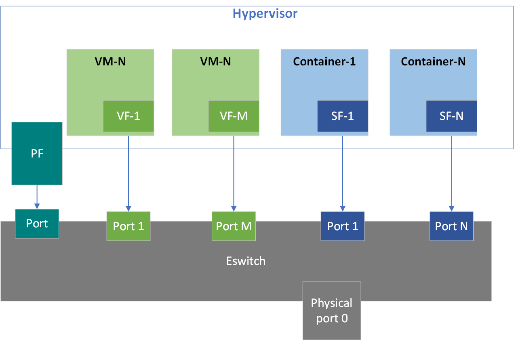
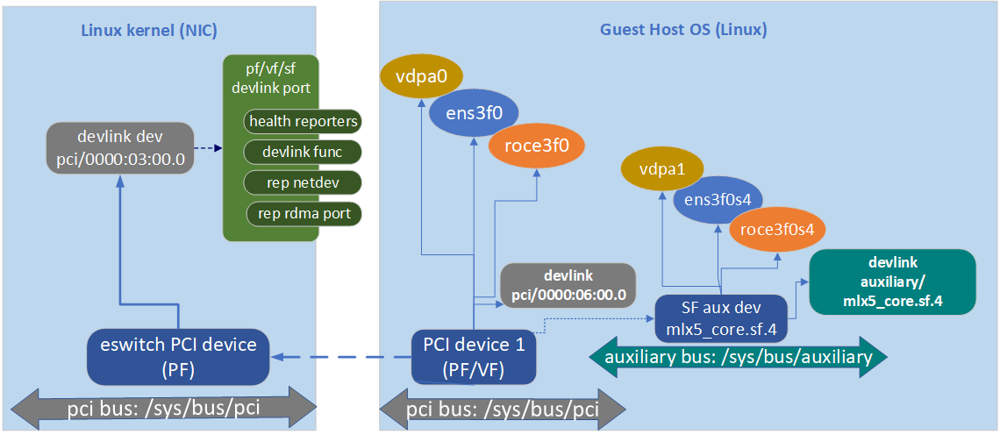

Overview
---------

Scalable function is a lightweight function that has a parent PCI function on
which it is deployed. mlx5 scalable function has its own function capabilities
and its own resources. This means a scalable function has its own dedicated
queues(txq, rxq, cq, eq). These queues are neither shared nor stolen from
the parent PCI function.

There is no special support needed from system BIOS to use scalable functions.
Scalable functions co-exist with PCI SR-IOV virtual functions.
Scalable functions do not require enabling PCI SR-IOV.

mlx5 scalable function is implemented using Linux kernel [subfunction][1].

Refer to [step by step guide][3] on how to use them.

Internals
---------
* When scalable function is RDMA capable, it has its own QP1, GID table and rdma
resources neither shared nor stolen from the parent PCI function.

* A scalable function has dedicated window in PCI BAR space that is not shared
with the other scalable functions or parent PCI function. This ensures that all
class devices of the scalable function accesses only assigned PCI BAR space.

* A scalable function supports eswitch representation through which it supports tc
offloads. User must configure eswitch to send/receive packets from/to
scalable function port.

* Scalable functions share PCI level resources such as PCI MSI-X IRQs with
their other scalable function and/or with its parent PCI function.

For more information about subfunction refer to the kernel's [subfunction documentation][1]
and [mlx5 subfunction documentation][2].

Overall design approach discussed with wider community, developers, vendors at [netdev conference 0x14][4]. Its [presentation][5] contains slides, discussion and Q&A.

[1]: https://git.kernel.org/pub/scm/linux/kernel/git/torvalds/linux.git/tree/Documentation/networking/devlink/devlink-port.rst?h=v5.12-rc3#n125
[2]: https://git.kernel.org/pub/scm/linux/kernel/git/torvalds/linux.git/tree/Documentation/networking/device_drivers/ethernet/mellanox/mlx5.rst?h=v5.12-rc3#n186
[3]: https://github.com/Mellanox/scalablefunctions/wiki/Step-by-step-guide
[4]: https://netdevconf.info/0x14/pub/slides/45/sf_mgmt_using_devlink_netdevconf_0x14.pdf
[5]: https://www.youtube.com/watch?v=bwu5ED6QcoA